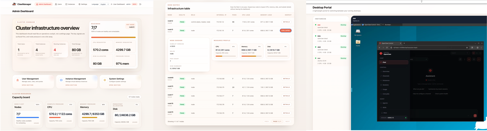

# ClawManager

<p align="center">
  
</p>

<p align="center">
  OpenClaw의 클러스터 단위 배치 배포와 운영을 위해 설계된 세계 최초의 플랫폼입니다.
</p>

<p align="center">
  <strong>언어:</strong>
  <a href="./README.md">English</a> |
  <a href="./README.zh-CN.md">中文</a> |
  <a href="./README.ja.md">日本語</a> |
  한국어 |
  <a href="./README.de.md">Deutsch</a>
</p>

<p align="center">
  
  
  
  
  
</p>

<p align="center">
  
  
  
  
  
</p>

## 🚀 News

- [03/20/2026] **ClawManager 신규 출시** - ClawManager는 가상 데스크톱 관리 플랫폼으로 정식 출시되었으며, 배치 배포, Webtop 지원, 데스크톱 Portal 접근, 런타임 이미지 설정, OpenClaw 메모리/환경설정 Markdown 백업 및 마이그레이션, 클러스터 자원 개요, 다국어 문서를 제공합니다.

## 👀 Overview

ClawManager는 Kubernetes 기반 가상 데스크톱 관리 플랫폼입니다. 데스크톱 런타임 운영, 사용자 거버넌스, 안전한 클러스터 내부 접근을 포함하는 완전한 제어 평면을 제공합니다.

ClawManager는 배치 배포, 인스턴스 생명주기 관리, 관리자 콘솔, 프록시 기반 데스크톱 접근, 런타임 이미지 제어, 클러스터 자원 가시성, OpenClaw 메모리/환경설정 백업 및 마이그레이션 기능을 하나의 플랫폼에 통합합니다.

ClawManager는 다음과 같은 환경을 위해 설계되었습니다:

- 여러 사용자용 가상 데스크톱 인스턴스를 생성하고 관리해야 하는 환경
- 관리자가 quota, 이미지, 인스턴스를 중앙에서 통제해야 하는 환경
- 데스크톱 서비스가 Kubernetes 내부에 유지되고 인증 프록시를 통해 노출되어야 하는 환경
- 운영자가 인스턴스 상태, 클러스터 용량, 런타임 상태를 통합해서 봐야 하는 환경

요약하면 ClawManager는:

- OpenClaw 및 Linux 데스크톱 런타임을 위한 중앙 운영 콘솔
- Kubernetes 기반 다중 사용자 데스크톱 관리 플랫폼
- 토큰 인증 프록시를 통한 내부 데스크톱 보안 접근 계층

## ✨ At a Glance

- 멀티테넌트 데스크톱 인스턴스 관리
- 사용자 또는 런타임 프로파일 기준의 데스크톱 인스턴스 배치 배포
- CPU, 메모리, 스토리지, GPU, 인스턴스 수에 대한 사용자 quota 제어
- OpenClaw, Webtop, Ubuntu, Debian, CentOS, 사용자 정의 런타임 지원
- 토큰 생성과 WebSocket 포워딩을 통한 안전한 데스크톱 프록시 접근
- OpenClaw 메모리, 환경설정, Markdown 구성 데이터의 백업 및 마이그레이션
- 사용자, 인스턴스, 이미지 카드, 클러스터 자원을 위한 관리자 대시보드
- 다국어 UI: 영어, 중국어, 일본어, 한국어, 독일어

> 🧭 ClawManager는 관리자 제어, 안전한 데스크톱 접근, 런타임 운영을 하나의 제어 평면에 통합합니다.

<p align="center">
  
</p>

## 📚 Table of Contents

- [News](#news)
- [Overview](#overview)
- [ClawManager New Features](#clawmanager-new-features)
- [Key Features](#key-features)
- [Typical Workflow](#typical-workflow)
- [Architecture](#architecture)
- [Project Structure](#project-structure)
- [Tech Stack](#tech-stack)
- [Kubernetes Prerequisites](#kubernetes-prerequisites)
- [Installation](#installation)
- [Quick Start](#quick-start)
- [Configuration](#configuration)
- [Documentation](#documentation)
- [License](#license)

## 🆕 ClawManager New Features

ClawManager의 주요 기능:

- 🖥 브라우저 기반 데스크톱 접근을 위한 `webtop` 런타임 지원
- 📦 대규모 데스크톱 프로비저닝을 위한 배치 배포 기능
- 🚪 실행 중인 인스턴스를 한 곳에서 전환할 수 있는 Desktop Portal 페이지
- 🔐 토큰 기반 인스턴스 접근 엔드포인트와 리버스 프록시 라우팅
- 🔄 데스크톱 세션 및 상태 업데이트를 위한 WebSocket 포워딩
- 🧠 OpenClaw 메모리, 환경설정, Markdown 구성 데이터 백업/가져오기 API
- 🧩 지원되는 각 인스턴스 타입별 런타임 이미지 카드 관리
- 📊 노드, CPU, 메모리, 스토리지를 포함한 클러스터 자원 개요
- 👨‍💼 사용자 간 필터링과 제어가 가능한 전역 관리자 인스턴스 관리
- 📥 기본 비밀번호 생성이 포함된 CSV 사용자 가져오기
- 🌍 5개 언어를 지원하는 국제화 프론트엔드

## 🛠 Key Features

- ⚙️ 인스턴스 생명주기 관리: 생성, 시작, 중지, 재시작, 삭제, 조회, 강제 동기화
- 📦 대규모 데스크톱 롤아웃을 위한 배치 배포 지원
- 🧱 지원 런타임 타입: `openclaw`, `webtop`, `ubuntu`, `debian`, `centos`, `custom`
- 🔒 인증된 프록시 엔드포인트를 통한 안전한 데스크톱 접근
- 📡 WebSocket 기반 실시간 상태 업데이트
- 📝 OpenClaw 메모리, 환경설정, Markdown 구성 데이터 아카이브 백업/가져오기
- 📏 인스턴스 수, CPU, 메모리, 스토리지, GPU에 대한 사용자 단위 quota 관리
- 🖼 관리자 패널에서의 런타임 이미지 오버라이드 관리
- 🛰 클러스터 자원 개요와 인스턴스 상태를 제공하는 관리자 대시보드
- 👥 CSV 일괄 사용자 가져오기와 중앙 quota 할당
- 🌐 다국어 UI 및 관리자/일반 사용자 역할별 뷰

## 🔄 Typical Workflow

1. 👨‍💼 관리자가 로그인하여 사용자, quota, 런타임 이미지 설정을 구성합니다.
2. 🖥 사용자가 OpenClaw, Webtop, Ubuntu 같은 데스크톱 인스턴스를 생성합니다.
3. ☸️ ClawManager가 Kubernetes 자원을 생성하고 런타임 상태를 계속 동기화합니다.
4. 🔐 사용자는 Portal 또는 토큰 기반 프록시 엔드포인트를 통해 데스크톱에 접근합니다.
5. 📊 관리자는 관리자 대시보드에서 인스턴스 상태와 클러스터 자원을 모니터링합니다.

## 🏗 Architecture

```text
Browser
  -> ClawManager Frontend (React + Vite)
  -> ClawManager Backend (Go + Gin)
  -> MySQL
  -> Kubernetes API
  -> Pod / PVC / Service
  -> OpenClaw / Webtop / Linux Desktop Runtime
```

### High-Level Design

- 프론트엔드: React 19 + TypeScript + Tailwind CSS
- 백엔드: Go + Gin + upper/db + MySQL
- 런타임: Kubernetes
- 접근 계층: WebSocket 포워딩을 지원하는 인증 리버스 프록시
- 데이터 계층: 업무 데이터용 MySQL, 인스턴스 영속 스토리지용 PVC

## 🗂 Project Structure

```text
ClawManager/
├── backend/            # Go 백엔드 API
├── frontend/           # React 프론트엔드
├── deployments/        # 컨테이너 및 Kubernetes 배포 파일
├── dev_docs/           # 설계 및 구현 문서
├── scripts/            # 보조 스크립트
├── TASK_BREAKDOWN.md   # 상세 작업 분해
└── dev_progress.md     # 개발 진행 기록
```

## 💻 Tech Stack

### Backend

- Go 1.21+
- Gin
- upper/db
- MySQL 8.0+
- JWT 인증

### Frontend

- React 19
- TypeScript 5.9
- Vite 7
- Tailwind CSS 4
- React Router

### Infrastructure

- Kubernetes
- Docker
- Nginx

## ☸️ Kubernetes Prerequisites

ClawManager는 Kubernetes-first 프로젝트입니다. 관리 대상 노드가 Kubernetes 클러스터에 가입해야만 인스턴스 스케줄링, 자원 확인, 통합 운영이 가능합니다.

ClawManager를 설치하기 전에 동작 가능한 Kubernetes 환경을 준비하고, `kubectl`이 클러스터에 접근 가능한지 확인하세요:

```bash
kubectl get nodes
```

### Linux 설치 예시

`k3s` 사용:

```bash
curl -sfL https://get.k3s.io | sh -
sudo kubectl get nodes
```

`microk8s` 사용:

```bash
sudo snap install microk8s --classic
sudo microk8s status --wait-ready
sudo microk8s kubectl get nodes
```

### Kubernetes 기본 명령

```bash
kubectl get nodes
kubectl get pods -A
kubectl get pvc -A
kubectl cluster-info
```

### 최소 권장 사양

- Kubernetes 노드 1개
- 4 CPU
- 8 GB RAM
- 20+ GB 사용 가능 디스크

여러 데스크톱 인스턴스를 동시에 실행하려면 더 많은 CPU, 메모리, 스토리지를 할당하세요.

## 📦 Installation

설치 전에 다음을 확인하세요:

- MySQL 사용 가능
- Kubernetes 사용 가능
- `kubectl get nodes` 정상 동작

MySQL을 시작하고 데이터베이스 마이그레이션을 실행합니다:

```bash
cd backend
make docker-up
make migrate
```

의존성을 설치합니다:

```bash
cd frontend
npm install

cd ../backend
go mod tidy
```

### Kubernetes 배포 예시

저장소에 포함된 매니페스트를 바로 적용합니다:

```bash
kubectl apply -f deployments/k8s/clawmanager.yaml
kubectl get pods -A
kubectl get svc -A
```

## ⚡ Quick Start

### Backend

```bash
cd backend
make run
```

기본 백엔드 주소:

- `http://localhost:9001`

### Frontend

```bash
cd frontend
npm run dev
```

기본 프론트엔드 주소:

- `http://localhost:9002`

### Default Accounts

- 기본 관리자 계정: `admin / admin123`
- 가져온 관리자 사용자의 기본 비밀번호: `admin123`
- 가져온 일반 사용자의 기본 비밀번호: `user123`

### First Login

1. 👨‍💼 관리자 계정으로 로그인합니다.
2. 👥 사용자를 생성하거나 가져오고 quota를 할당합니다.
3. 🧩 필요하면 시스템 설정에서 런타임 이미지 카드를 구성합니다.
4. 🖥 일반 사용자로 로그인하여 인스턴스를 생성합니다.
5. 🔗 Portal View 또는 Desktop Access를 통해 데스크톱에 접근합니다.

## ⚙️ Configuration

ClawManager는 명확한 보안 모델을 따릅니다:

- 인스턴스 서비스는 Kubernetes 내부 네트워크를 사용합니다
- 데스크톱 접근은 ClawManager 백엔드 인증 프록시를 거칩니다
- backend는 클러스터 내부에 배포하는 것이 가장 좋습니다
- 런타임 이미지는 시스템 설정에서 중앙 관리할 수 있습니다
- 관리 대상 노드는 모두 동일한 Kubernetes 클러스터에 속해야 합니다

주요 백엔드 환경 변수:

- `SERVER_ADDRESS`
- `SERVER_MODE`
- `DB_HOST`
- `DB_PORT`
- `DB_USER`
- `DB_PASSWORD`
- `DB_NAME`
- `JWT_SECRET`

프론트엔드 개발 모드에서는 Vite가 `/api`를 백엔드로 프록시합니다.

### CSV Import Template

```csv
Username,Email,Role,Max Instances,Max CPU Cores,Max Memory (GB),Max Storage (GB),Max GPU Count (optional)
```

참고:

- `Email`은 선택 사항입니다
- `Max GPU Count (optional)`은 선택 사항입니다
- 그 외 모든 열은 필수입니다
- quota 값은 클러스터 용량 계획과 맞아야 합니다

## 📘 Documentation

- [TASK_BREAKDOWN.md](./TASK_BREAKDOWN.md)
- [dev_progress.md](./dev_progress.md)
- [dev_docs/README_DOCS.md](./dev_docs/README_DOCS.md)
- [dev_docs/ARCHITECTURE_SIMPLE.md](./dev_docs/ARCHITECTURE_SIMPLE.md)
- [dev_docs/MONITORING_DASHBOARD.md](./dev_docs/MONITORING_DASHBOARD.md)
- [backend/README.md](./backend/README.md)
- [frontend/README.md](./frontend/README.md)

## 📄 License

이 프로젝트는 MIT License로 배포됩니다.

## ❤️ Open Source

기능, 문서, 테스트 개선을 포함한 issue와 pull request를 환영합니다.
